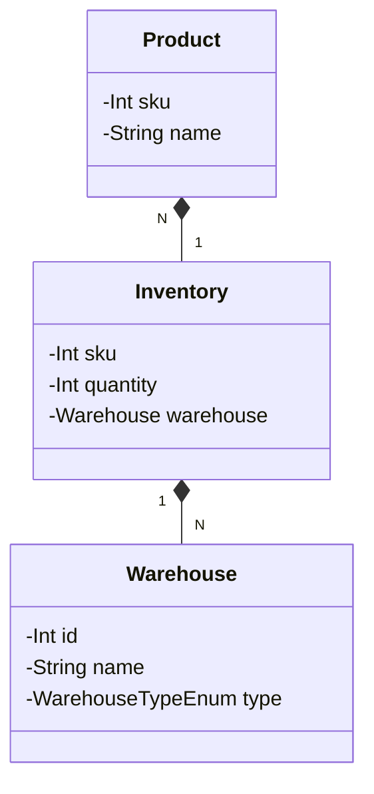

### gb-test-kotlin

Meu desenvolvimento para o projeto
https://github.com/belezanaweb/test-java em versão Kotlin,
com algumas modificações e uma abordagem simulando a utilização de microsserviços.

### Tecnologias utilizadas
- Kotlin
- Spring Boot

### **Importante:**  
Alguns conceitos e regras foram adotados apenas para fins de demonstração e desenvolvimento. Jamais refletiria o comportamento de um sistema real em ambiente de produção.

### Diagrama de Classes
Apesar de ter sido proposto no projeto a utilizaçõa de um enpoint unico para obter dados de produto e de estoque e armazem,
entendi que eles devem ser únicos e comunicarem entre si para obter as informações desejadas. Segue abaixo a minha proposta de criação.

O diagrama de classes foi feito utilizando a ferramenta [Mermaid](https://mermaid-js.github.io/mermaid/#/)

### Serviços
Apesar de ter sido proposto no projeto a utilizaçõa de um enpoint unico para obter dados de produto e de estoque e armazem, 
entendi que eles devem ser únicos e comunicarem entre si para obter as informações desejadas. Segue abaixo a minha proposta de criação.
- **Product** - Microsserviço responsável por gerenciar os produtos
    - **POST api/products** - Cria um novo produto
    - **PUT api/products/{sku}** - Atualiza um produto existente
    - **GET api/products/{sku}** - Retorna os dados de um produto pelo sku
    - **DELETE api/products/{sku}** - Remove um produto existente
  

- **Inventory** - Microsserviço responsável por gerenciar o estoque dos produtos
    - **POST api/inventory?sku={sku}&warehouseId={warehouseId}&quantity={quantity}** - Cria um novo estoque para um produto
    - **PUT api/inventory/{sku}/{warehouseId}** - Atualiza o estoque de um produto existente
    - **GET api/inventory?sku={sku}** - Retorna o estoque de um produto pelo sku
    - **DELETE api/inventory/{sku}** - Remove o estoque de um produto existente

### Próximos passos
[ ] Implementar testes unitários

[ ] Incluir a execução dos serviços via Docker